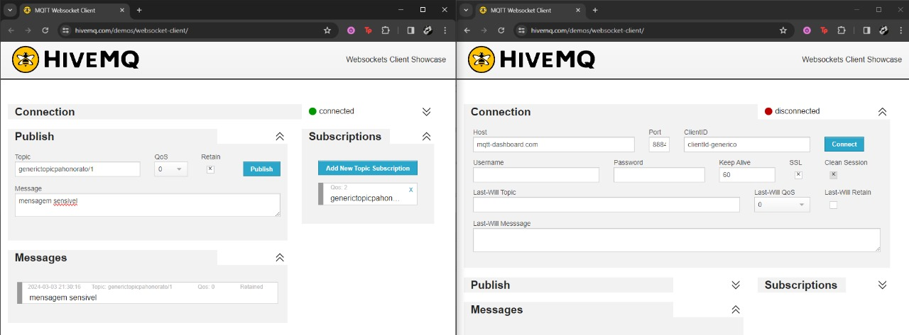
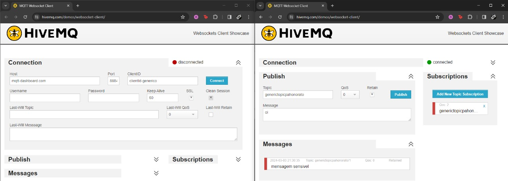
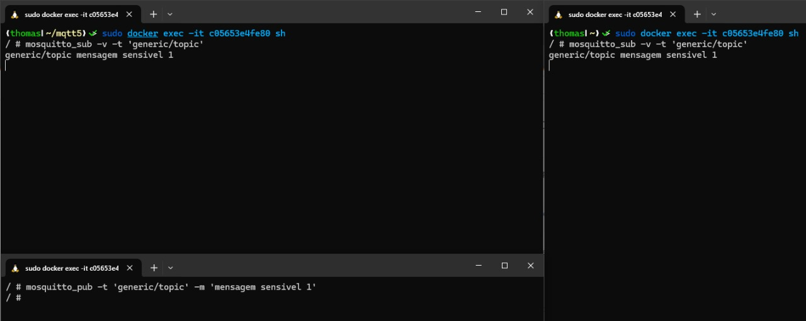
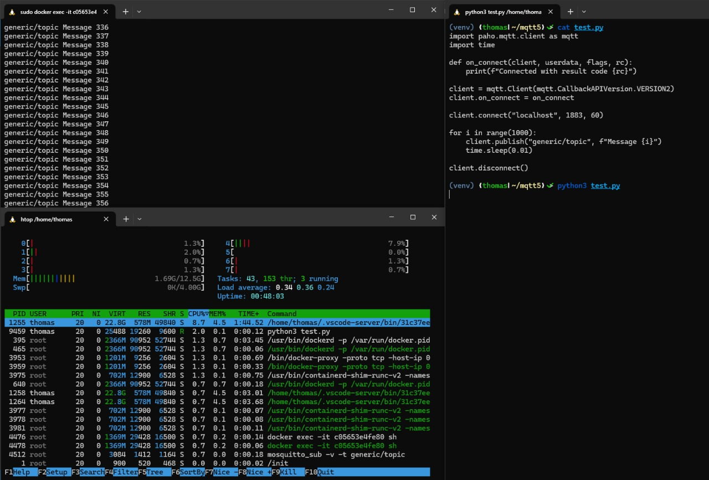
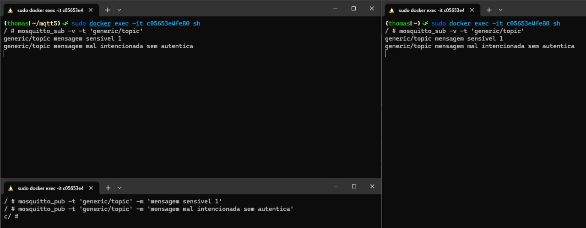
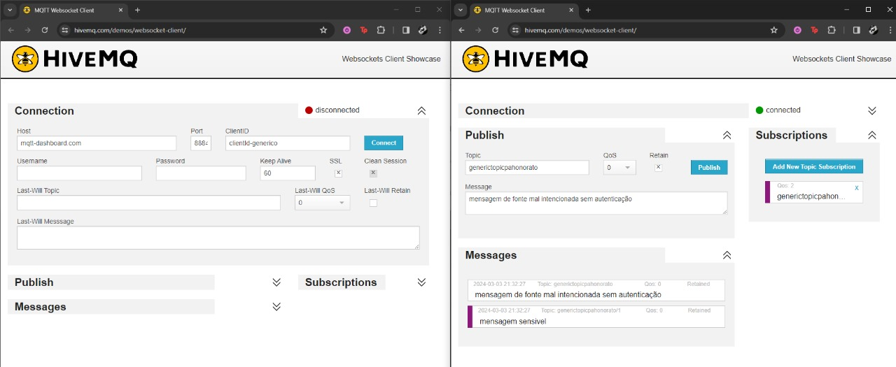
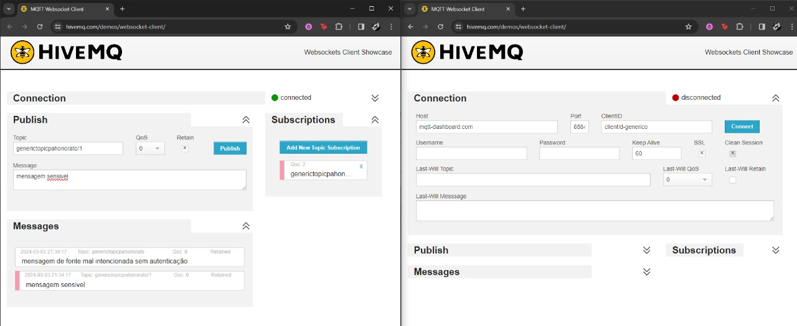

# Relatório de Simulação de Ataques usando MQTT

**Desenvolvido por:** Patricia Honorato Moreira e Luiz Fernando da Silva Borges

# Configuração do Ambiente

## Broker Remoto

Utilizamos o HiveMQ WebSocket Client para Web, pois já vem com um broker default pré-configurado.

## Broker Local com Mosquitto

A configuração foi feita seguindo o tutorial elaborado pelo professor, presente em: [Tutorial Broker Local Mosquitto](https://rmnicola.github.io/m9-ec-encontros/e3)

## Confidencialidade

### Teste executado

Foi simulado um cenário onde múltiplos clientes conectam-se ao broker MQTT usando o mesmo ClientID em sessões diferentes, explorando a configuração que permite conexões anônimas `(allow_anonymous true)`.

### Evidências

1. **Broker Remoto**

2. **Broker Local**

A simulação mostrou que, ao usar o mesmo ClientID em múltiplas instâncias, é possível interceptar mensagens não destinadas ao ator original, comprometendo a confidencialidade das comunicações.

## Disponibilidade

### Teste executado

Desenvolvimento de um [script](https://github.com/ipatriciahonorato/modulo-9/blob/main/ponderada-3/src/load_test.py) que explora a ausência de autenticação no broker local para publicar mensagens em massa, demonstrando como informações falsas ou manipuladas podem ser inseridas no sistema, afetando a integridade dos dados.

1. **Broker Local**

O teste no broker local mostrou que, sob condições de carga intensa, o serviço pode tornar-se instável ou até mesmo indisponível, destacando uma vulnerabilidade crítica na disponibilidade do sistema.

2. **Broker Remoto**

Optamos por não realizar este teste no broker remoto (HiveMQTT) devido a questões éticas e legais, focando nossa simulação apenas no ambiente local.

## Integridade 

### Teste executado

Para avaliar a vulnerabilidade relacionada à integridade, foram realizados testes em ambos, um broker MQTT local e um broker MQTT remoto. O objetivo desses testes foi demonstrar a capacidade de um ator não autenticado publicar mensagens em tópicos específicos, sem qualquer forma de autenticação.

Utilizamos clientes MQTT simples para conectar aos brokers e publicar mensagens em tópicos sem exigir credenciais de autenticação. Isso foi feito para simular um ator mal-intencionado que tenta injetar dados falsos ou manipulados no sistema.

1. **Broker Local**

2. **Broker Remoto**

Nos testes, foi observado que, tanto no broker local quanto no remoto, foi possível publicar mensagens em tópicos específicos sem autenticação. Isso confirmou a vulnerabilidade na integridade dos dados, onde informações não verificadas podem ser facilmente inseridas e potencialmente aceitas como legítimas pelo sistema.

# Conclusão geral

Nesta atividade, investigamos as vulnerabilidades associadas aos pilares da Confidencialidade, Integridade e Disponibilidade em sistemas MQTT, através de testes em um broker local e remoto. Os resultados demonstraram que tanto a utilização compartilhada de ClientIDs quanto a ausência de autenticação podem facilmente comprometer a segurança das comunicações, permitindo a interceptação ou a inserção de mensagens não autorizadas. Essas descobertas sublinham a importância de práticas rigorosas de segurança, como autenticação efetiva e gerenciamento adequado de identidades, para proteger as informações transmitidas.

